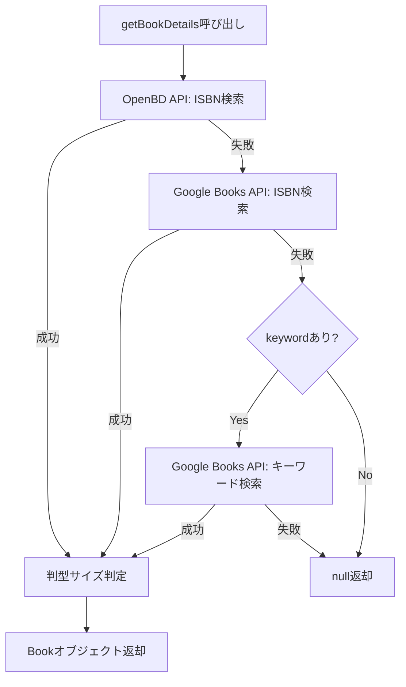

# Issue #3 実装完了レポート

## 📋 実装概要
ISBNコードまたはキーワードを元に、外部APIから書籍情報を取得するロジックを実装しました。

## ✅ 完了した作業

### 1. GoogleBooksDataSource の作成
**ファイル**: `app/src/main/java/com/example/bookstack/data/remote/book/GoogleBooksDataSource.kt`

- ✅ `BookDataSource` インターフェースを実装
- ✅ `getBookByIsbn(isbn: String)` メソッドの実装
- ✅ `searchBooksByKeyword(keyword: String)` メソッドの実装
- ✅ Google Books APIへのHTTPリクエスト処理
- ✅ エラーハンドリングの実装

### 2. BookRepository の作成
**ファイル**: `app/src/main/java/com/example/bookstack/data/repository/BookRepository.kt`

- ✅ コンストラクタで `OpenBdDataSource`, `GoogleBooksDataSource` に依存
- ✅ `getBookDetails(isbn: String, keyword: String? = null): Book?` メソッドの実装
- ✅ データ取得の優先順位ロジック実装:
  1. OpenBD APIでISBN検索
  2. Google Books APIでISBN検索（OpenBDで見つからない場合）
  3. Google Books APIでキーワード検索（ISBNで見つからず、keywordが指定されている場合）
- ✅ `BookSizeConverter` を使用した判型サイズの判定ロジック
- ✅ エラーハンドリング（全データソースで失敗した場合nullを返す）

### 3. DI（依存性注入）の設定
**ファイル**: `app/src/main/java/com/example/bookstack/di/AppModule.kt`

- ✅ `OpenBdDataSource` のシングルトン登録
- ✅ `GoogleBooksDataSource` のシングルトン登録
- ✅ `BookRepository` のシングルトン登録
- ✅ 依存関係の自動注入設定

### 4. 単体テストの実装
**ファイル**: `app/src/test/java/com/example/bookstack/data/repository/BookRepositoryTest.kt`

- ✅ OpenBDで書籍が見つかる場合のテスト
- ✅ OpenBDで見つからず、Google Booksで見つかる場合のテスト
- ✅ ISBNで見つからず、キーワードで検索する場合のテスト
- ✅ 全てのデータソースで見つからない場合のテスト
- ✅ ページ数がnullの場合の処理テスト
- ✅ 判型サイズが既に設定されている場合の動作テスト

**テスト結果**: ✅ 全6テスト成功

### 5. ビルド設定の更新
**ファイル**: 
- `gradle/libs.versions.toml`
- `app/build.gradle.kts`

- ✅ Ktor MockEngine依存関係の追加（テスト用）

## 📊 完了条件の達成状況

| 完了条件 | 状態 | 備考 |
|---------|------|------|
| ISBNを渡すと、タイトル・著者・画像URL・ページ数・サイズ判定結果が返ってくる | ✅ | `BookRepository.getBookDetails()` で実現 |
| ページ数がない場合、nullまたはデフォルト値が返る処理が入っている | ✅ | `Book.pageCount` がnullable型で実装済み |
| OpenBDで見つからない場合、Google Books APIへのフォールバックが機能する | ✅ | 実装＆テストで確認済み |
| 判型サイズが正しく判定され、`Book.bookSize` に設定される | ✅ | `BookSizeConverter` 使用で実現 |
| 関連する単体テストが記述されている | ✅ | `BookRepositoryTest.kt` で6テスト実装 |

## 🏗️ アーキテクチャ遵守状況

### Google推奨アーキテクチャの適用
- ✅ **関心の分離**: DataSource（API層）とRepository（ビジネスロジック層）を分離
- ✅ **Single Source of Truth**: `BookRepository` が唯一の信頼できる情報源として機能
- ✅ **依存性の注入**: Koinを使用したDI実装

### データフロー
```
UI Layer (未実装)
    ↓
Repository Layer (BookRepository) ← 今回実装
    ↓
DataSource Layer (OpenBdDataSource, GoogleBooksDataSource) ← 今回実装
    ↓
External APIs (OpenBD, Google Books)
```

## 🔧 技術スタック遵守状況

- ✅ **Kotlin**: 最新の機能を使用（suspend関数、null安全性）
- ✅ **Ktor Client**: HTTP通信に使用
- ✅ **kotlinx.serialization**: JSONデシリアライズに使用
- ✅ **Koin**: 依存性注入に使用
- ✅ **JUnit + Coroutines Test**: 単体テストに使用

## 📝 データ取得の優先順位フロー



## 🎯 次のステップ

Issue #3の実装は完了しました。次は以下の作業が推奨されます：

1. **UI Layerの実装**: `BookRepository` を使用して書籍検索画面を実装
2. **ViewModelの作成**: `BookSearchViewModel` などを作成し、UIとRepositoryを接続
3. **統合テスト**: 実際のAPIを使った統合テストの実装（オプション）
4. **エラーハンドリングの拡張**: より詳細なエラーメッセージの提供

## 🐛 既知の制約事項

- Google Books APIのCコード情報がない場合、判型サイズの判定精度が低下する可能性があります
- キーワード検索では複数の結果から最初の1件のみを返します
- ネットワークエラー時のリトライロジックは未実装です（必要に応じて今後追加）

## 📚 参考情報

- OpenBD API: https://openbd.jp/
- Google Books API: https://developers.google.com/books
- Ktor Documentation: https://ktor.io/
- Android Architecture Guide: https://developer.android.com/topic/architecture
