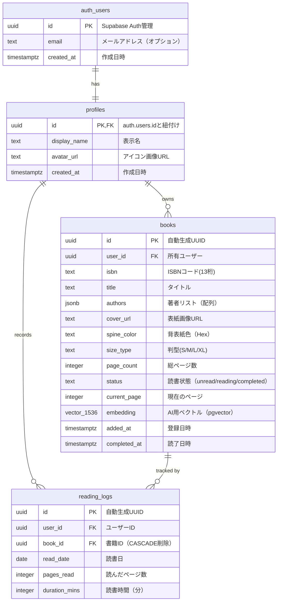

# BookStack データベース ER図

## Entity Relationship Diagram



---

## テーブル詳細

### 1. `auth.users` テーブル
**管理:** Supabase Auth（自動管理）  
**説明:** 認証情報を管理する内部テーブル。匿名ユーザーもここにレコードが作成される。

---

### 2. `public.profiles` テーブル
**管理:** アプリケーション  
**説明:** ユーザーの公開プロフィール情報。`auth.users`と1対1で紐付く。

**RLSポリシー:**
- 全員が閲覧可能（SELECT）
- 自分のプロフィールのみ作成・更新可能（INSERT/UPDATE）

**トリガー設定推奨:**
```sql
-- auth.usersにユーザーが作成されたら自動でprofilesレコードを作成
CREATE OR REPLACE FUNCTION public.handle_new_user()
RETURNS trigger AS $$
BEGIN
  INSERT INTO public.profiles (id, display_name)
  VALUES (new.id, 'ユーザー' || substring(new.id::text from 1 for 8));
  RETURN new;
END;
$$ LANGUAGE plpgsql SECURITY DEFINER;

CREATE TRIGGER on_auth_user_created
  AFTER INSERT ON auth.users
  FOR EACH ROW EXECUTE FUNCTION public.handle_new_user();
```

---

### 3. `public.books` テーブル
**管理:** アプリケーション  
**説明:** ユーザーが登録した書籍情報。

**特記事項:**
- `authors`はJSONB型で複数著者に対応
- `embedding`は将来のAIレコメンド機能用（pgvector拡張必須）
- `status`はCHECK制約で3値のみ許可

**RLSポリシー:**
- 自分の書籍のみ全操作可能（SELECT/INSERT/UPDATE/DELETE）

---

### 4. `public.reading_logs` テーブル
**管理:** アプリケーション  
**説明:** 日次の読書記録（ヒートマップ表示用）。

**特記事項:**
- `book_id`は`ON DELETE CASCADE`で書籍削除時に自動削除
- 同じ日付に複数回記録可能（集計はアプリ側で実施）

**RLSポリシー:**
- 自分のログのみ全操作可能（ALL）

---

## リレーションシップの説明

### `auth.users` → `profiles` (1:1)
- **カーディナリティ:** 1対1
- **外部キー:** `profiles.id` REFERENCES `auth.users.id`
- **削除時の動作:** Supabase Authでユーザー削除時に自動削除（CASCADE）

### `profiles` → `books` (1:N)
- **カーディナリティ:** 1対多
- **外部キー:** `books.user_id` REFERENCES `profiles.id`
- **削除時の動作:** プロフィール削除時に書籍も削除（推奨: CASCADE設定）

### `profiles` → `reading_logs` (1:N)
- **カーディナリティ:** 1対多
- **外部キー:** `reading_logs.user_id` REFERENCES `profiles.id`
- **削除時の動作:** プロフィール削除時にログも削除（推奨: CASCADE設定）

### `books` → `reading_logs` (1:N)
- **カーディナリティ:** 1対多
- **外部キー:** `reading_logs.book_id` REFERENCES `books.id` ON DELETE CASCADE
- **削除時の動作:** 書籍削除時にログも自動削除（CASCADE設定済み）

---

## インデックス推奨

パフォーマンス向上のため、以下のインデックスを作成することを推奨します。

```sql
-- booksテーブル
CREATE INDEX idx_books_user_id ON public.books(user_id);
CREATE INDEX idx_books_status ON public.books(status);
CREATE INDEX idx_books_isbn ON public.books(isbn);

-- reading_logsテーブル
CREATE INDEX idx_reading_logs_user_id ON public.reading_logs(user_id);
CREATE INDEX idx_reading_logs_book_id ON public.reading_logs(book_id);
CREATE INDEX idx_reading_logs_read_date ON public.reading_logs(read_date);

-- embeddingベクトル検索用（AI機能実装時）
CREATE INDEX idx_books_embedding ON public.books USING ivfflat (embedding vector_cosine_ops);
```

---

## データ型の補足

### `jsonb` (authors)
**例:**
```json
["村上春樹", "柴田元幸"]
```

**クエリ例:**
```sql
-- 著者に「村上春樹」を含む書籍を検索
SELECT * FROM books WHERE authors @> '["村上春樹"]'::jsonb;
```

---

### `vector(1536)` (embedding)
**説明:**
- OpenAIの`text-embedding-ada-002`モデルの出力次元数
- pgvector拡張機能で提供される型
- コサイン類似度検索が可能

**クエリ例:**
```sql
-- 類似書籍を検索（ベクトル類似度順）
SELECT * FROM books
ORDER BY embedding <=> '[0.1, 0.2, ...]'::vector
LIMIT 10;
```

---

## RLS (Row Level Security) 設定状況

| テーブル | RLS有効 | ポリシー概要 |
|---------|---------|-------------|
| `profiles` | ✅ | 全員が閲覧可、自分のみ編集可 |
| `books` | ✅ | 自分の書籍のみ全操作可 |
| `reading_logs` | ✅ | 自分のログのみ全操作可 |

**セキュリティ効果:**
- 匿名ユーザーでも`auth.uid()`で識別可能
- 他のユーザーのデータは完全に隔離される
- アプリ側でのフィルタリングが不要（PostgreSQL側で保証）

---

## 参考情報

- [Supabase Database Documentation](https://supabase.com/docs/guides/database)
- [pgvector Documentation](https://github.com/pgvector/pgvector)
- [PostgreSQL JSONB Documentation](https://www.postgresql.org/docs/current/datatype-json.html)
