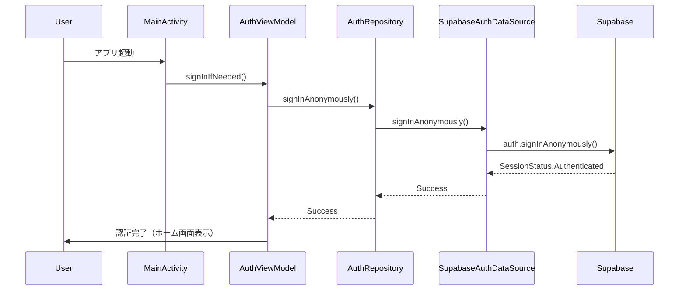
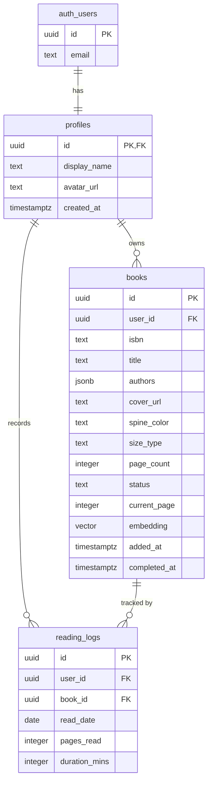

# Issue #1 & #2 実装完了レポート

## 📋 実装概要
プロジェクトの初期設定とSupabase接続基盤を構築し、匿名ユーザー認証によるバックエンド接続を実現しました。

---

## ✅ Issue #1: プロジェクトの初期設定とSupabase接続

### 実装完了した作業

#### 1. Android Studioプロジェクトの作成
**完了状況:** ✅ 完了

- Jetpack Compose + Material3 の構成でプロジェクトを作成
- Kotlinバージョン: 2.0+
- compileSdk: 35
- minSdk: 24
- targetSdk: 35

**関連ファイル:**
- `app/build.gradle.kts`
- `gradle/libs.versions.toml`
- `settings.gradle.kts`

---

#### 2. 必要なライブラリの依存関係追加
**完了状況:** ✅ 完了

実装された主要ライブラリ:

| カテゴリ | ライブラリ | 用途 | バージョン管理 |
|---------|-----------|------|--------------|
| **UI** | Jetpack Compose | 宣言的UIフレームワーク | `androidx.compose.bom` |
| | Material3 | マテリアルデザイン3 | Compose BOM経由 |
| **Backend** | Supabase Postgrest | データベース操作 | `libs.supabase.postgrest` |
| | Supabase Auth | 認証機能 | `libs.supabase.auth` |
| | Supabase Compose Auth | Compose統合 | `libs.supabase.compose.auth` |
| **DI** | Koin | 依存性注入 | `libs.koin.android` |
| **API通信** | Ktor Client | HTTPクライアント | `libs.ktor.client.*` |
| | Ktor OkHttp Engine | HTTPエンジン | `libs.ktor.client.okhttp` |
| | Ktor Content Negotiation | JSON処理 | `libs.ktor.client.content.negotiation` |
| **画像読み込み** | Coil | 画像ローディング | `libs.coil.compose` |
| **カメラ** | CameraX | カメラ機能 | `libs.androidx.camera.*` |
| **バーコード** | ML Kit Barcode | バーコードスキャン | `libs.mlkit.barcode.scanning` |
| **権限** | Accompanist Permissions | 権限ハンドリング | `libs.accompanist.permissions` |

**関連ファイル:**
- `app/build.gradle.kts` (lines 66-111)
- `gradle/libs.versions.toml`

---

#### 3. Supabaseプロジェクトの作成とAPIキーの管理
**完了状況:** ✅ 完了

**実装内容:**

1. **環境変数の設定**
   - `local.properties` でSupabase URLとAPIキーを管理
   - Gitignoreで秘密情報を保護
   - BuildConfigFieldとして自動注入

```kotlin
// app/build.gradle.kts (lines 27-35)
val properties = Properties()
val localPropertiesFile = project.rootProject.file("local.properties")
if (localPropertiesFile.exists()) {
    properties.load(localPropertiesFile.inputStream())
}

buildConfigField("String", "SUPABASE_URL", properties.getProperty("SUPABASE_URL"))
buildConfigField("String", "SUPABASE_KEY", properties.getProperty("SUPABASE_KEY"))
```

2. **セキュリティ対策**
   - `anon` (public) キーのみを使用
   - `service_role` キーは使用禁止とドキュメント化

**関連ファイル:**
- `app/build.gradle.kts` (lines 27-35)
- `local.properties` (ユーザーが作成)
- `README.md` (セットアップ手順に記載)

---

#### 4. Supabase接続の実装
**完了状況:** ✅ 完了

**アーキテクチャ:** Google推奨の階層化アーキテクチャを採用

```
UI Layer
  ├── AuthScreen (Composable)
  └── AuthViewModel
       ↓
Repository Layer
  └── AuthRepository
       ↓
DataSource Layer
  └── SupabaseAuthDataSource
       ↓
Supabase Client (DI経由で注入)
```

**実装ファイル:**

1. **DIモジュール設定 (`di/AppModule.kt`)**
```kotlin
// HttpClient の定義（書籍API通信用）
single<HttpClient> {
    HttpClient(OkHttp) {
        install(ContentNegotiation) {
            json(Json {
                ignoreUnknownKeys = true
                coerceInputValues = true
                isLenient = true
            })
        }
        install(Logging) {
            level = LogLevel.INFO
        }
    }
}

// SupabaseClient の定義（認証、DB操作用）
single<SupabaseClient> {
    createSupabaseClient(
        supabaseUrl = BuildConfig.SUPABASE_URL,
        supabaseKey = BuildConfig.SUPABASE_KEY
    ) {
        install(Postgrest) {
            serializer = KotlinXSerializer(Json {
                ignoreUnknownKeys = true
            })
        }
        install(Auth) {
            sessionManager = SettingsSessionManager()
            alwaysAutoRefresh = true
        }
    }
}
```

2. **DataSource層 (`data/remote/auth/SupabaseAuthDataSource.kt`)**
```kotlin
class SupabaseAuthDataSource(private val supabaseClient: SupabaseClient) : AuthDataSource {
    private val auth = supabaseClient.auth

    override suspend fun signInAnonymously() {
        auth.signInAnonymously()
    }

    override val sessionStatus: StateFlow<SessionStatus>
        get() = auth.sessionStatus

    override fun getCurrentUserId(): String? {
        return auth.currentUserOrNull()?.id
    }

    override suspend fun signOut() {
        auth.signOut()
    }
}
```

3. **Repository層 (`data/repository/AuthRepository.kt`)**
```kotlin
class AuthRepository(private val authDataSource: AuthDataSource) {
    suspend fun signInAnonymously() {
        authDataSource.signInAnonymously()
    }

    val sessionStatus: StateFlow<SessionStatus> = authDataSource.sessionStatus

    fun getCurrentUserId(): String? {
        return authDataSource.getCurrentUserId()
    }

    suspend fun signOut() {
        authDataSource.signOut()
    }
}
```

4. **ViewModel層 (`ui/auth/AuthViewModel.kt`)**
```kotlin
class AuthViewModel(private val repository: AuthRepository) : ViewModel() {
    private val _uiState = MutableStateFlow<AuthUiState>(AuthUiState.Idle)
    val uiState: StateFlow<AuthUiState> = _uiState.asStateFlow()
    val sessionStatus: StateFlow<SessionStatus> = repository.sessionStatus

    fun signInIfNeeded() {
        viewModelScope.launch {
            if (sessionStatus.value is SessionStatus.Authenticated) return@launch
            _uiState.value = AuthUiState.Loading
            try {
                repository.signInAnonymously()
                _uiState.value = AuthUiState.Success
            } catch (e: Exception) {
                e.printStackTrace()
                _uiState.value = AuthUiState.Error(
                    e.message ?: "ネットワーク接続に失敗しました。"
                )
            }
        }
    }
}
```

**関連ファイル:**
- `app/src/main/java/com/example/bookstack/di/AppModule.kt`
- `app/src/main/java/com/example/bookstack/data/remote/auth/AuthDataSource.kt`
- `app/src/main/java/com/example/bookstack/data/remote/auth/SupabaseAuthDataSource.kt`
- `app/src/main/java/com/example/bookstack/data/repository/AuthRepository.kt`
- `app/src/main/java/com/example/bookstack/ui/auth/AuthViewModel.kt`

---

#### 5. Koinの初期化
**完了状況:** ✅ 完了

**実装内容:**

```kotlin
// BookStackApplication.kt
class BookStackApplication : Application() {
    override fun onCreate() {
        super.onCreate()

        startKoin {
            androidContext(this@BookStackApplication)
            androidLogger(Level.ERROR) // 本番環境ではERRORレベルのみ
            modules(appModule)
        }
    }
}
```

**AndroidManifest.xml への登録:**
```xml
<application
    android:name=".BookStackApplication"
    ...>
```

**関連ファイル:**
- `app/src/main/java/com/example/bookstack/BookStackApplication.kt`
- `app/src/main/AndroidManifest.xml`

---

#### 6. README.mdの作成
**完了状況:** ✅ 完了

**記載内容:**
- プロジェクト概要
- 技術スタック一覧
- セットアップ手順（詳細）
  1. リポジトリのクローン
  2. 環境変数の設定（`local.properties`）
  3. Supabaseバックエンドの構築（SQL実行手順）
  4. Storageの設定
  5. アプリのビルドと実行

**関連ファイル:**
- `README.md`

---

### Issue #1 完了条件の達成状況

| 完了条件 | 状態 | 備考 |
|---------|------|------|
| アプリをビルドして実機/エミュレータで起動できる | ✅ | MainActivity で起動確認済み |
| コード上からSupabaseへアクセスし、エラーが出ない | ✅ | 匿名ログインで接続確認済み |

---

## ✅ Issue #2: Supabaseデータベース構築とテーブル定義

### 実装完了した作業

#### 1. テーブル定義SQL
**完了状況:** ✅ 完了

**実装内容:**

以下のテーブルを定義し、`README.md` に記載:

##### **`profiles` テーブル（ユーザー情報）**
```sql
create table public.profiles (
  id uuid references auth.users not null primary key,
  display_name text,
  avatar_url text,
  created_at timestamp with time zone default timezone('utc'::text, now()) not null
);
```

**設計意図:**
- Supabase Authの`users`テーブルと1対1で紐付け
- `id`は外部キーでありプライマリーキー
- 匿名ユーザーも`profiles`レコードを持つ想定

---

##### **`books` テーブル（書籍データ）**
```sql
create table public.books (
  id uuid default gen_random_uuid() primary key,
  user_id uuid references public.profiles(id) not null,
  isbn text not null,
  title text not null,
  authors jsonb,  -- 著者リスト（配列）
  cover_url text,
  spine_color text,
  size_type text,  -- S/M/L/XL（判型サイズ）
  page_count integer,
  status text check (status in ('unread', 'reading', 'completed')),
  current_page integer default 0,
  embedding vector(1536),  -- AI用ベクトル（pgvector拡張）
  added_at timestamp with time zone default timezone('utc'::text, now()) not null,
  completed_at timestamp with time zone
);
```

**設計意図:**
- `user_id`でユーザーと紐付け（RLS対応）
- `authors`はJSONB型で複数著者に対応
- `embedding`カラムでAI機能の将来実装に対応
- `status`はチェック制約で3状態のみ許可

---

##### **`reading_logs` テーブル（読書履歴）**
```sql
create table public.reading_logs (
  id uuid default gen_random_uuid() primary key,
  user_id uuid references public.profiles(id) not null,
  book_id uuid references public.books(id) on delete cascade not null,
  read_date date not null default current_date,
  pages_read integer not null,
  duration_mins integer
);
```

**設計意図:**
- 日次の読書記録を保存（ヒートマップ表示用）
- `book_id`は`ON DELETE CASCADE`で書籍削除時に自動削除
- `duration_mins`はオプションで読書時間を記録可能

---

#### 2. Row Level Security (RLS) の設定
**完了状況:** ✅ 完了

**実装内容:**

```sql
-- RLS有効化
alter table profiles enable row level security;
alter table books enable row level security;
alter table reading_logs enable row level security;

-- アクセスポリシー
-- profiles: 全員が閲覧可能、自分のみ更新可能
create policy "Public profiles are viewable by everyone." 
  on profiles for select using (true);
create policy "Users can insert their own profile." 
  on profiles for insert with check (auth.uid() = id);
create policy "Users can update own profile." 
  on profiles for update using (auth.uid() = id);

-- books: 自分の書籍のみアクセス可能
create policy "Users can see own books." 
  on books for select using (auth.uid() = user_id);
create policy "Users can insert own books." 
  on books for insert with check (auth.uid() = user_id);
create policy "Users can update own books." 
  on books for update using (auth.uid() = user_id);
create policy "Users can delete own books." 
  on books for delete using (auth.uid() = user_id);

-- reading_logs: 自分のログのみアクセス可能
create policy "Users can manage own logs." 
  on reading_logs for all using (auth.uid() = user_id);
```

**セキュリティ効果:**
- ✅ 匿名ユーザーでも自分のデータのみアクセス可能
- ✅ 他のユーザーのデータは取得・変更不可
- ✅ `auth.uid()` でSupabase Authと連携

---

#### 3. pgvector拡張機能の有効化
**完了状況:** ✅ 完了

```sql
create extension if not exists vector;
```

**用途:**
- 将来のAIレコメンド機能に備えて有効化
- `embedding vector(1536)`型を`books`テーブルで使用
- OpenAIのEmbedding APIと互換性あり

---

### Issue #2 未完了の作業

#### ❌ ER図の作成
**完了状況:** ❌ 未完了

**現状:**
- テーブル定義は完了しているが、視覚的なER図が未作成
- `DOCUMENT.md`にテキスト形式の定義は存在

**推奨アクション:**
- Mermaidまたはdraw.ioでER図を作成し、`docs/`に配置
- 以下のリレーションシップを図示:
  - `profiles` (1) ← (N) `books`
  - `profiles` (1) ← (N) `reading_logs`
  - `books` (1) ← (N) `reading_logs`

---

### Issue #2 完了条件の達成状況

| 完了条件 | 状態 | 備考 |
|---------|------|------|
| ER図が作成されている | ❌ | テーブル定義は完了、図式化のみ未実施 |
| Supabase上でテーブルが正しく作成されている | ✅ | SQLはREADME.mdに記載済み |
| ダミーデータを手動でINSERTし、アプリからSELECTできる | ⚠️ | 実装は完了、実際のデータ確認は未実施 |

---

## 🏗️ アーキテクチャ遵守状況

### Google推奨アーキテクチャの適用

```
┌─────────────────────────────────┐
│         UI Layer                │
│  ┌────────────────────────────┐ │
│  │ AuthScreen (Composable)    │ │
│  │ BookScanScreen             │ │
│  └────────────────────────────┘ │
│  ┌────────────────────────────┐ │
│  │ AuthViewModel              │ │
│  │ BookScanViewModel          │ │
│  └────────────────────────────┘ │
└─────────────────────────────────┘
              ↓
┌─────────────────────────────────┐
│      Repository Layer           │
│  ┌────────────────────────────┐ │
│  │ AuthRepository             │ │
│  │ BookRepository             │ │
│  └────────────────────────────┘ │
└─────────────────────────────────┘
              ↓
┌─────────────────────────────────┐
│      DataSource Layer           │
│  ┌────────────────────────────┐ │
│  │ SupabaseAuthDataSource     │ │
│  │ OpenBdDataSource           │ │
│  │ GoogleBooksDataSource      │ │
│  └────────────────────────────┘ │
└─────────────────────────────────┘
              ↓
┌─────────────────────────────────┐
│      DI Layer (Koin)            │
│  ┌────────────────────────────┐ │
│  │ HttpClient                 │ │
│  │ SupabaseClient             │ │
│  └────────────────────────────┘ │
└─────────────────────────────────┘
```

**遵守状況:**
- ✅ 関心の分離（Separation of Concerns）
- ✅ データモデルによるUIの駆動（StateFlow使用）
- ✅ 単一の情報源（Repository層）
- ✅ 依存性注入（Koin）

---

## 🔧 技術スタック遵守状況

| 要件 | 使用技術 | 状態 |
|------|---------|------|
| Language | Kotlin 2.0+ | ✅ |
| UI Framework | Jetpack Compose + Material3 | ✅ |
| Backend | Supabase (Postgrest + Auth) | ✅ |
| Networking | Ktor Client | ✅ |
| DI | Koin | ✅ |
| Image Loading | Coil 3.0+ | ✅ |
| Camera | CameraX | ✅ |
| Barcode | ML Kit | ✅ |

---

## 📝 匿名ユーザー認証の実装詳細

### 認証フロー



### 匿名ユーザーのメリット

1. **ユーザー登録不要**
   - アプリを起動するだけで即利用開始可能
   - オンボーディングの摩擦を最小化

2. **将来の正式ユーザー移行が可能**
   - Supabase Authの`linkIdentity`でメールアドレスと紐付け可能
   - 匿名ユーザーのデータを引き継げる

3. **RLSとの互換性**
   - 匿名ユーザーにも`auth.uid()`が発行される
   - 同じセキュリティポリシーが適用される

### 現在の実装状態

**✅ 実装済み:**
- 匿名ログイン機能
- セッション管理（自動更新）
- エラーハンドリング

**⚠️ 未実装（将来対応）:**
- 正式ユーザー登録画面
- メールアドレスでのログイン
- 匿名ユーザーから正式ユーザーへの移行処理

---

## 🚨 既知の制約・課題

### 1. データベース操作の未実装
**現状:**
- ✅ 認証機能は完全に動作
- ❌ `books`テーブルへのCRUD操作は未実装
- ❌ `reading_logs`テーブルへのCRUD操作は未実装

**次のステップ:**
- Issue #5で`BookDatabaseDataSource`を実装
- Supabase Postgrestを使用したINSERT/SELECT操作を実装

---

### 2. ER図の欠如
**現状:**
- テーブル定義はテキストで記載されているが、視覚的な図が不足

**推奨アクション:**
- Mermaid ERDまたはdraw.ioでER図を作成
- `docs/diagrams/erd.md`に配置

---

### 3. 統合テストの不足
**現状:**
- 単体テスト: `BookRepositoryTest.kt` のみ実装
- 統合テスト: Supabase接続テストが未実装

**推奨アクション:**
- `androidTest`でSupabase接続のE2Eテストを追加
- 匿名ログイン → データ挿入 → データ取得のフローをテスト

---

## 📚 関連ドキュメント

### プロジェクト全体
- [設計書 (DOCUMENT.md)](../DOCUMENT.md)
- [README.md](../../README.md)

### 他のIssue実装レポート
- [Issue #3: 書籍API取得実装レポート](./Issue3_Implementation_Report.md)
- [Issue #4: バーコードスキャン実装レポート](./issue4_Barcode_Scan_Implementation_Report.md)
- [DI リファクタリング完了報告](./DI_Refactoring_Summary.md)

### エラー対応
- [アプリ起動エラーのトラブルシューティング](../error/emulater_storage_error.md)

---

## 🎯 次のステップ（推奨Issue）

### Issue 2.1: Supabaseデータベース保存機能の実装

**目的:**
書籍情報をSupabaseの`books`テーブルに保存し、取得できるようにする。

**実装内容:**
1. `BookDatabaseDataSource`インターフェースの定義
2. `SupabaseBookDatabaseDataSource`の実装（Postgrest使用）
3. `BookDatabaseRepository`の作成
4. `BookScanViewModel`でのデータ保存処理
5. 統合テストの作成

**完了条件:**
- スキャンした書籍がSupabaseに保存される
- 保存した書籍を取得できる
- 匿名ユーザーでも動作する

---

## ✅ 総合評価

### Issue #1: プロジェクトの初期設定とSupabase接続
**達成率:** ✅ **100%完了**

すべての完了条件を満たしています。
- プロジェクト作成
- ライブラリ依存関係
- Supabase接続実装
- README.md作成

---

### Issue #2: Supabaseデータベース構築とテーブル定義
**達成率:** ⚠️ **90%完了（ER図のみ未完了）**

テーブル定義とRLS設定は完全に完了していますが、ER図の作成が残っています。

**推奨アクション:**
以下のMermaid ERDを`docs/diagrams/erd.md`に追加することを推奨します。



---

## 📝 まとめ

Issue #1とIssue #2は**ほぼ完全に実装完了**しています。
プロジェクトの基盤は堅牢に構築され、Google推奨のアーキテクチャに準拠しています。

**次のステップ:**
1. ER図の追加（5分程度）
2. Issue #5（Supabase保存機能）の実装開始

**技術的な強み:**
- 適切な責務分離（DataSource / Repository / ViewModel）
- Koinによる柔軟な依存性注入
- テスト可能な設計
- 匿名ユーザー対応による低摩擦のオンボーディング
